# SCISCUT - URL Shortener and QR Code Generator App

***...your favourite URL Shortener and QR Code Generator.***

## Introduction

This is a URL Shortener web app with the Backend built with **Flask RestX API** (Python Framework) and the Frontend built with **React.js** (JavaScript Framework), and deployed using render.com.

**Website:** https://sciscut.onrender.com

## Main Functionalities

- **URL Shortener** - for shortening your long URLs into an auto-generated 5-character long URL end part.
- **URL Customizer** - for customizing your long URL making it unique for personal or corporate use.
- **QR Code Generator** - for generating QR codes for any URL, and can be downloaded for external use on social media and media posters.
- **Click Analytics** - for getting and tracking your short URL click information, such as when and where the click was performed, therefore knowing how your URL is being visited.

## Concepts Applied

##### In Backend

* Basic Python Concepts.
* Routing and Use of Namespaces
* Database Models and Relationships
* Class Inheritance and Methods
* Database Management and Migrations
* JWT Tokens for Authentications and Authorizations.
* Environment Variables
* Configuration for Development, Test and Production
* Web/Internet Security
* Debugging
* Use of Regex

## Knowledge Acquired

* Deployment of both Web Service and Static Site on Render.com

## App Design and UI

### Navbar and Home Page

The Home page shows the lists of short URLs (if any) and displays any selected short URL details.

##### When Logged Out

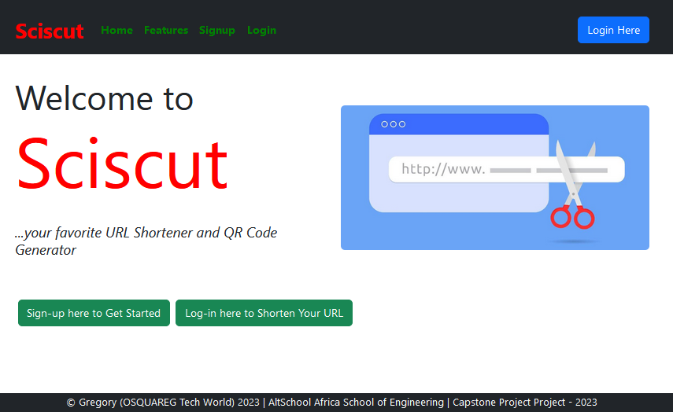

##### When Logged In (without Short URLs List)

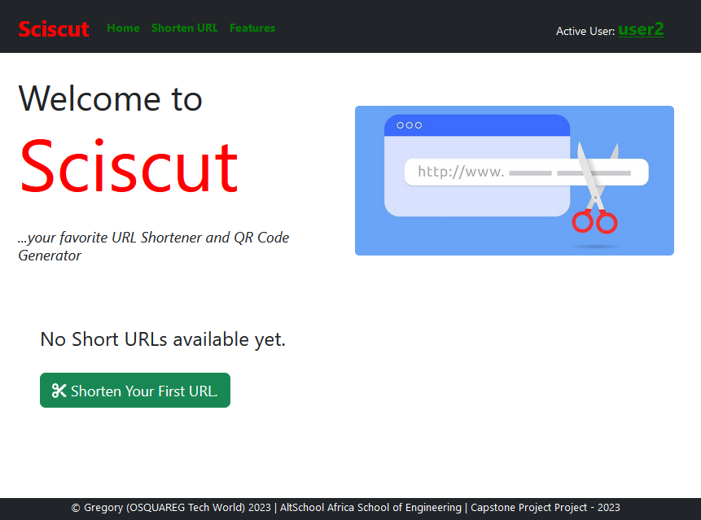

##### When Logged In (with Short URLs List)

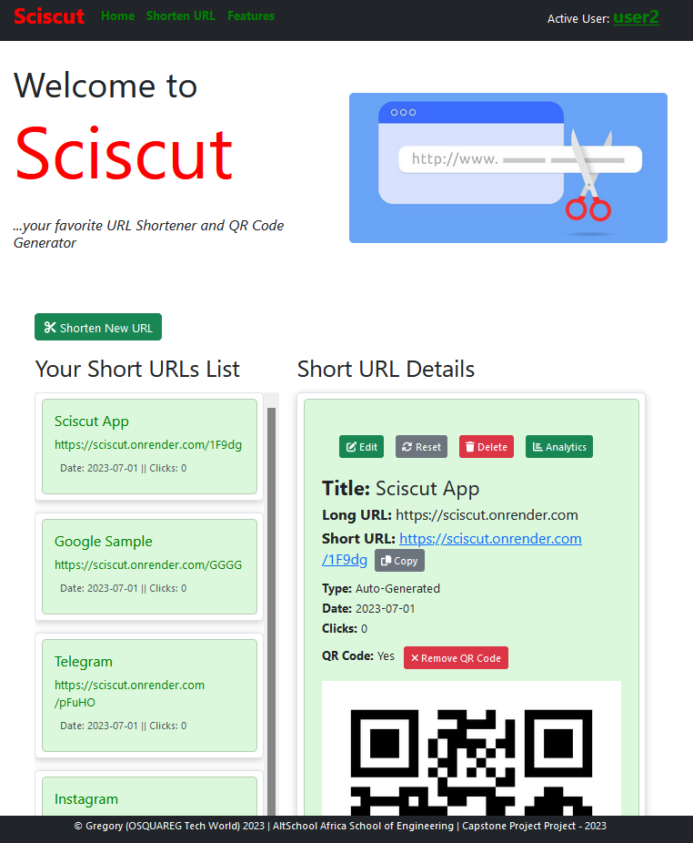

### Sign up Page

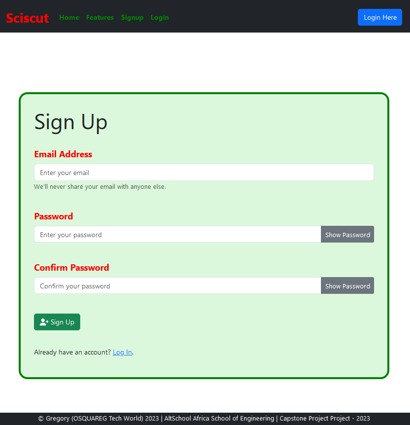

### Login Page

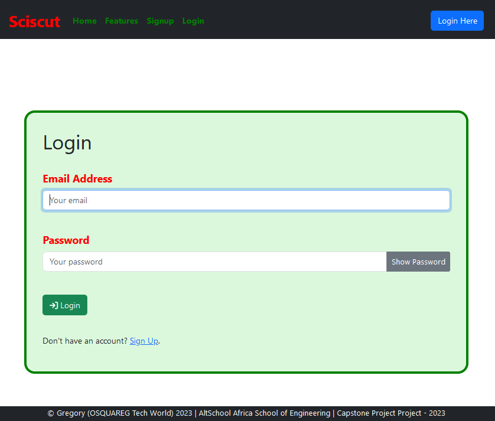

### User Account Menu

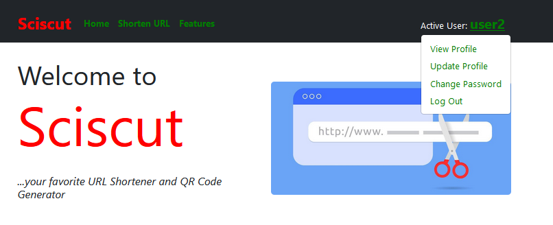

##### View Profile

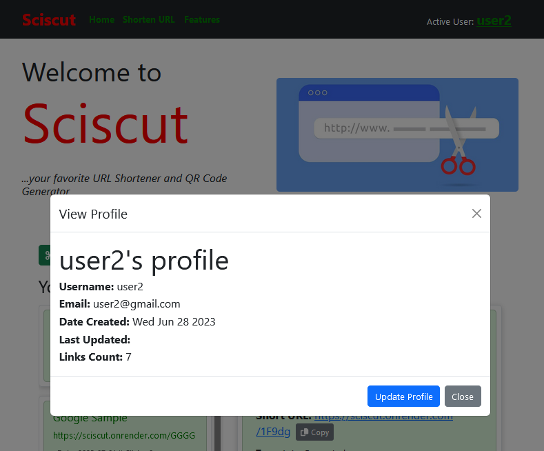

##### Update Profile

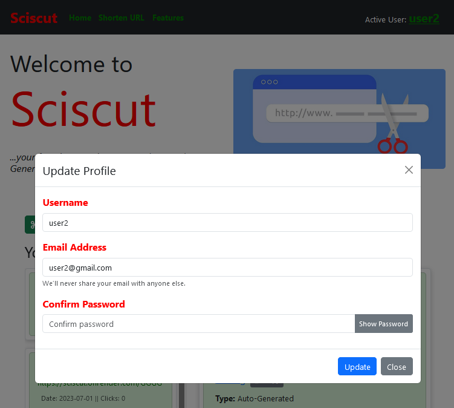

##### Change Password

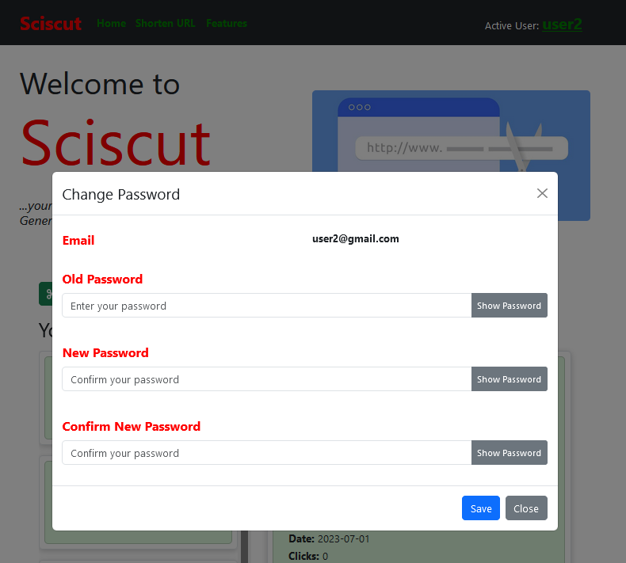

### Shorten URL Page

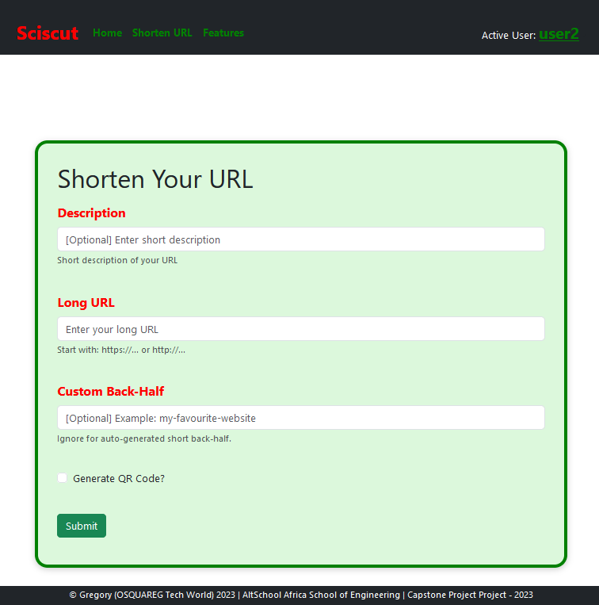

### Edit Short URL

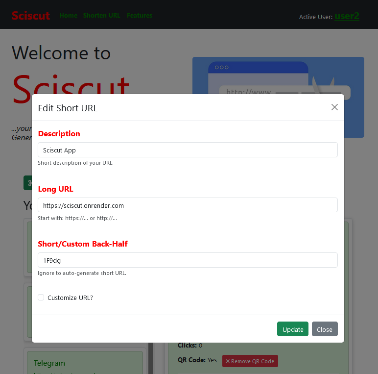

### Click Analytics Page (for single short URL)

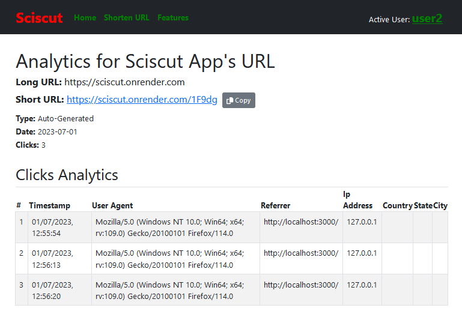

## Requirements

* Install **Python 3** - for the Backend (API). Download the installation file [here](https://www.python.org/downloads/)
* Other Packages.

## How to Run the Sciscut App

### Running Deployed App/API on Your Browser

To run the deployed app, simpy visit: https://sciscut.onrender.com

To check the API endpoints documentation, go to: https://sciscut-api.onrender.com

### Running App Locally on Your Window PC

##### Run the App Backend (Server-side)

1. Clone this repository with below command: on your terminal:

   ```
   $ git clone https://github.com/OSQUAREG/Scissor-URL-Shortener-API.git
   ```
2. CD into the Scissor-URL-Shortener-API folder.

   ```
   $ cd Scissor-URL-Shortener-API
   ```
3. Create and activate your virtual environment (for Windows).

   *For Windows OS.*

   ```
   $ python -m venv venv
   $ venv/Scripts/activate
   ```

   *OR*
   *For Linux or Mac OS.*

   ```
   $ python -m venv venv
   $ venv/bin/activate
   ```
4. Install all the dependencies in the [requirements.txt](https://github.com/OSQUAREG/Scissor-URL-Shortener-API/blob/main/requirements.txt) file:

   ```
   $ pip install -r requirements.txt
   ```
5. Create the `.env` file in the project root directory. Then set the following environment variables in it:

   ```
   FLASK_APP = api/
   FLASK_DEBUG = True
   SECRET_KEY = "your-super-secret-key"
   JWT_SECRET_KEY = "your-super-secret-jwt-key"
   DEFAULT_ADMIN_PWD = "your-super-strong-admin-password"
   QR_CODE_FOLDER_PATH = "./client/public"
   ```
6. Create tables and also insert the defaults records data using the command below in the terminal:

   ```
   $ flask shell
   $ drop_create_all()
   $ exit()
   ```
7. Then run the development server with the below commands:

   ```
   $ flask run
   ```
8. Copy the server address https://localhost:5000 displayed on the terminal and paste on your browser to see all the Backend endpoints.

## License

Distributed under the MIT License. See [License](https://github.com/OSQUAREG/Scissor-URL-Shortener-API/blob/main/LICENSE) for more information.

## Contacts

You can contact me, Gregory Ogbemudia @OSQUAREG on:

[LinkedIn](https://www.linkedin.com/in/osquareg/) | [Twitter](https://twitter.com/OSQUAREG) | Email: [gregory.ogbemudia@gmail.com](mailto:gregory.ogbemudia@gmail.com)

## Acknowledgements

* [AltSchool Africa School of Software Engineering](https://altschoolafrica.com/schools/engineering)
* [Caleb Emelike](https://github.com/CalebEmelike)
* Other contributors and fellow students who supoorted at one point or the other.
